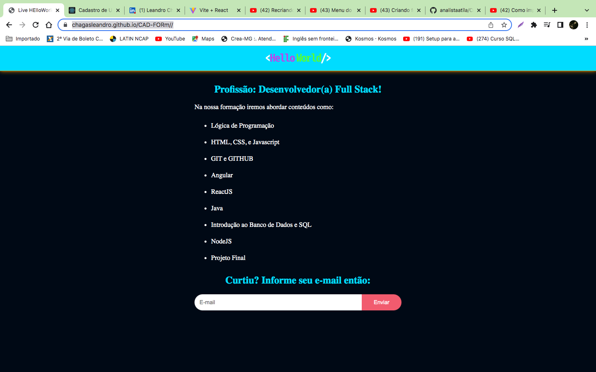

<p align="center">
  <a href="#-tecnologias">Tecnologias</a>&nbsp;&nbsp;&nbsp;|&nbsp;&nbsp;&nbsp;
  <a href="#-projeto">Projeto</a>&nbsp;&nbsp;&nbsp;|&nbsp;&nbsp;&nbsp;
  <a href="#-layout">Layout</a>&nbsp;&nbsp;&nbsp;|&nbsp;&nbsp;&nbsp;
</p>
<p align="center">
 

  
</p>

# 💻  Projeto
<p>CARD-Form em treinamento de HTML, CSS e JS um cadastro de e-mail de usuário.</p>

##  🚀 Tecnologias

Esse projeto foi desenvolvido usando as seguintes tecnologias:


      
</br></br>
      


## :wrench: Como Utilizar
```bash
# Clonando esse repositório
$ git clone https://github.com/chagasleandro/CAD-FORm
```

Em seguida execute o arquivo 'index.html' no seu navegador.

## 🔖 Layout

Você pode visualizar o layout do projeto através [desse link](https://chagasleandro.github.io/CAD-FORm//)
